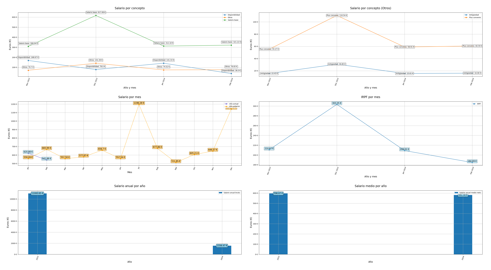

# Learning Data Science

Repositorio para aprender data science con Python y las herramientas Pandas y Matplotlib.



***NOTA: Los datos som de ejemplo por lo que la correspondencia entre gráficas no esta garantizada ya que mi objetivo es aprender las tecnologías.***

## Datos

Para aprender Pandas y Matplotlib he utilizados datos ficticios de conceptos percibidos en una nomina de 14 meses. Estos datos están guardados en una base de datos llamada `earnings.db` que se encuentra dentro de la carpeta `data`. Los esquemas de todas las tablas creadas en la base de datos están presentes en el archivo `tables.py`.

## Uso

- Hacer fork del repositorio
- Clonar repositorio forkeado
- Instalar las dependencias:

  ```bash
  pip install -r requirements.txt
  ```

- Ejecutar el Notebook `earnings.ipynb`
